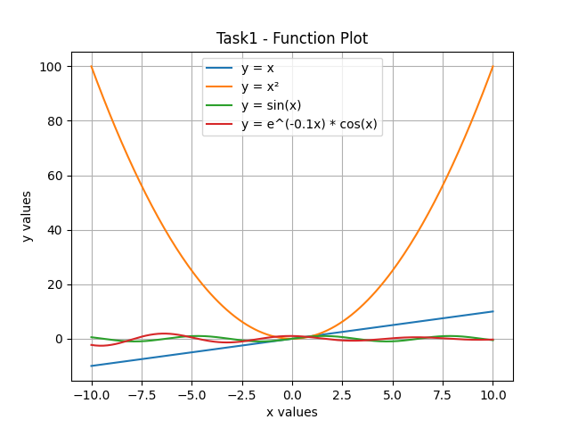
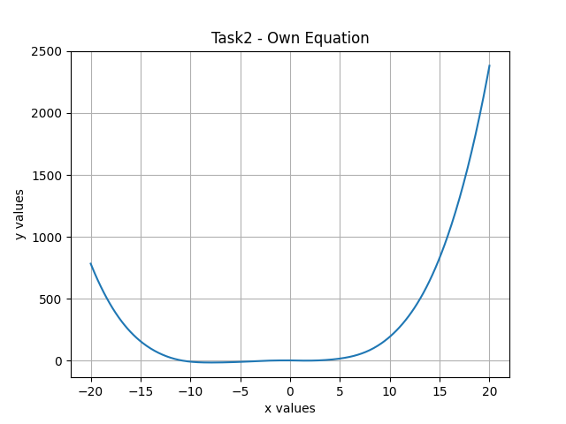
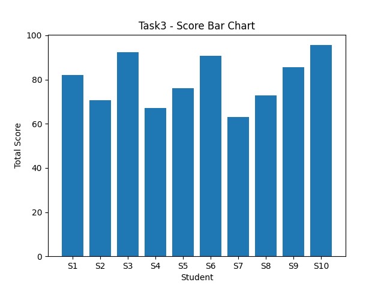
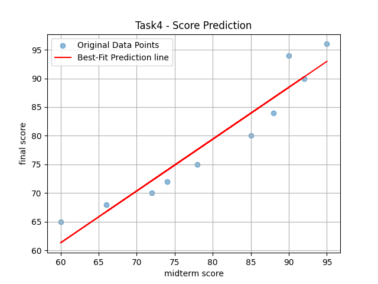

# Math Visualization Project
Create functions from simple to complex, visualize mathematical equations, and predict values using Python.


### Library
- Numpy
- Matplotlib


### How to run
1. Install the required libraries:

```bash
pip install numpy matplotlib

2. Run the python file:
math_visualization.ipynb

3. Generated graph images will be saved automatically as .png files.


### graphs overview

This graph compares linear, quadratic, trigonometric, and exponential functions.


This graph visualizes a custom mixed equation using polynomial, sine, and absolute value functions.


This bar chart shows the total scores of students based on weighted midterm and final scores.


This plot uses a best-fit line to visualize and predict final scores from midterm scores.


### How does visualization help us understand mathematical functions and data?
Visualization helps us understand patterns, trends, and relationships in mathematical functions and datasets. Graphs make it easier to see changes in values, compare data, and interpret equations visually instead of only using numbers.

### Which plot was most useful in this assignment and why?
The best-fit line plot was the most useful because it showed the relationship between midterm and final scores clearly. It also helped predict final scores from new midterm scores using linear regression.

### What is the role of NumPy and Matplotlib in your project?
NumPy is used to create and calculate numerical data efficiently.
Matplotlib is used to visualize the data and mathematical functions by creating graphs and plots.
